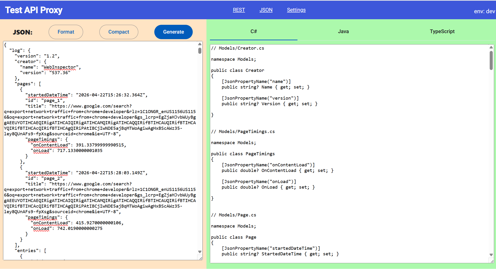
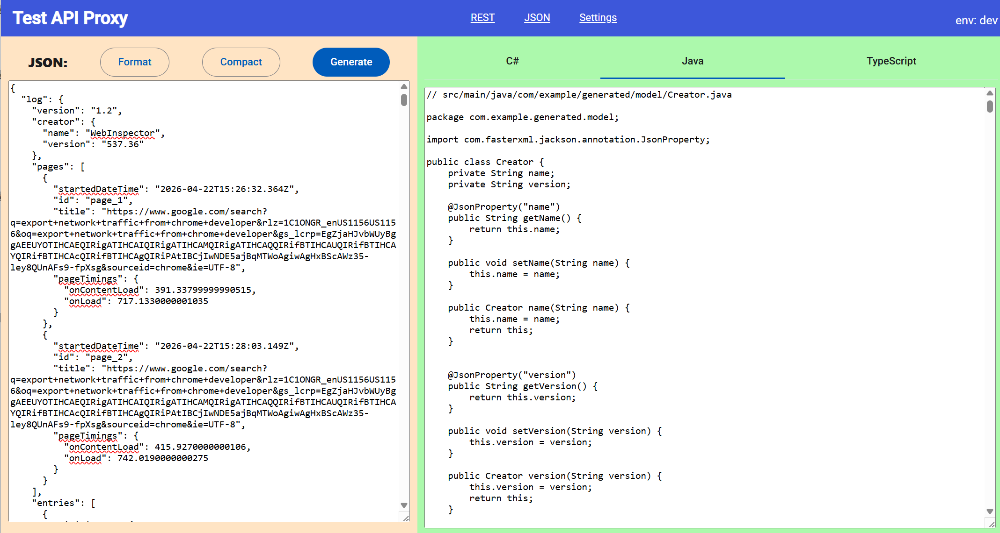
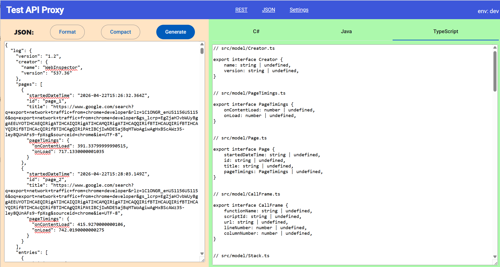

# api-proxy
A simple tool to trace, simulate and analyze REST API calls.
## The features and design
* a handy JSON pad generating C#, Java and TypeScript model codes from json.
* python backend including a console-api in fastapi.
* a simple http proxy which can catch and simulate REST API calls.
* a management console UI in Angular 21.
* allows to map remote REST services at local ports via UI, which can catch and simulate REST API calls for specific services.
* convert a REST call to curl format able to be imported in postman.
* generate server / client codes with templates and AI.
* configuration and runtime data are saved in local sqlite database.
  
## Installation (Windows)
### Check out the sources
```console
C:\foo> git clone https://github.com/lanceliangsoft/api-proxy
C:\foo> cd api-proxy
C:\foo\api-proxy>
```
### Create a virtual environment
Tested: python 3.13
```console
C:\foo\api-proxy> python -m venv .venv
C:\foo\api-proxy> .venv\Scripts\activate
(.venv) C:\foo\api-proxy>
```
#### Install the dependencies.

use uv
```console
(.venv) C:\foo\api-proxy> uv sync
```
or use pip
```console
(.venv) C:\foo\api-proxy> python -m pip install -r requirements.txt
```
#### Generate a self-signed certificate.
```console
(.venv) C:\foo\api-proxy> python make_cert.py
```
A self-signed certificate server.crt and key file server.key will be saved under the %USERPROFILE%\\.apiproxy\\certs folder.


### run the proxy
```console
(.venv) C:\foo\api-proxy> python -m apiproxy
Running in local environment, using SQLite C:\Users\me/.apiproxy/apiproxy.db
server http-proxy listens on 0.0.0.0:8001...
INFO:     Started server process [26256]
INFO:     Waiting for application startup.
INFO:     Application startup complete.
INFO:     Uvicorn running on http://0.0.0.0:8000 (Press CTRL+C to quit)
```

Access the management console via http://localhost:8000

## Generate models from json
Click the "JSON" link in banner, switch to the JSON Pad.

Edit or copy / paste a json text in the left side text area, click the "Generate" button, then model sources are generated in the right side.
### C# models


### Java models


### Typescript models


## Contacts
Author: Lance Liang (lanceliang2019@gmail.com)

